## Introduction
In this lab, the dev board for e155 was assembled by soldering surface mount and through hole components and a design was implemented on the FPGA (upduino) to read switches and control leds. The final design enabled the control of a seven segment display and onboard leds through onboard switches and also controlled an on-board led to flash at 2.4hz. Questa testbenches were created and run to verify the design of the modules implemented on the FPGA.

## Hardware
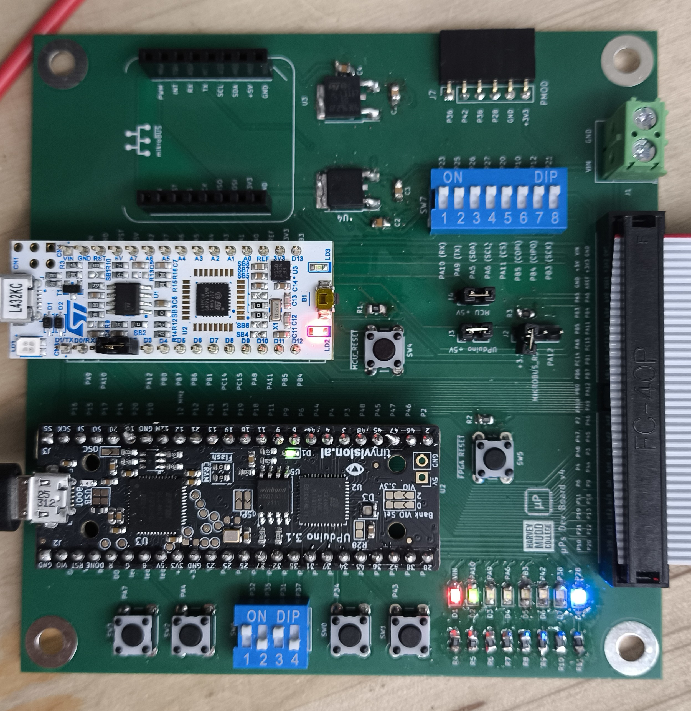

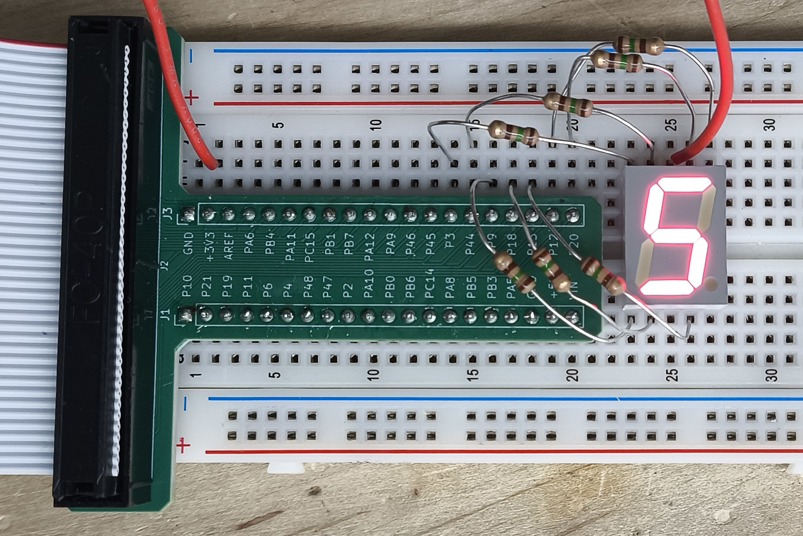

## Design and Testing Methodology
The flashing led was controlled using a counter implemented using sequential logic. The counter was implemented using a 25 bit register that was incremented on every clock cycle. The clock signal was a 48mhz signal generated by an onboard oscilator (HSOSC) integrated using the ice40 library. To achieve a 2.4hz signal, a max count of 20,000,000 (derivation later) was used as the period of flashing and the counter reset point. The module containing this logic was the heartbeat module which could be defined with parameters to change the width of the counter (from 25 bits) and the max count (from 20,000,000). A reset and enable signal were also included as inputs this module. Resset was used to set the counter to 0 and hold the led off. Enable was used to allow the counter to increment. The light was set off at a count of zero and set on at a count below max count (max count/2) to achieve the desired flashing frequency. The counter was tested by creating clk, reset, and enable signals in a testbench and sending them to the heartbeat module. Testing reset and enable was straightforward, but to test that the output signal properly changed and the counter wrapped properly, I set the counter externally from the testbench (I did it this way because I was worried 25 bits might be too long or have weird behaviour). The other on-board leds were controlled using one-line assign statements in the top module and tested along with module connections using an assert for input-output pairs. The seven segement decoder module was implemented using a case statement and tested using a testbench that iterated through all possible inputs (0-f) and checked the output against the expected output. The clock was tested by waiting for slightly over half the period of the flashing led (1/2.4hz/2) and asserting that the led signal had flipped states. This was repeated to ensure that it wasn't flashing at other frequencies that happened to match.

## Technical Documentation
The source code and all figures for the project can be found in the associated [Github repository](https://github.com/Jebeandiah/e155lab1.git)

### Block Diagram
::: {.callout-note collapse="true"}
## Expand to see block diagram
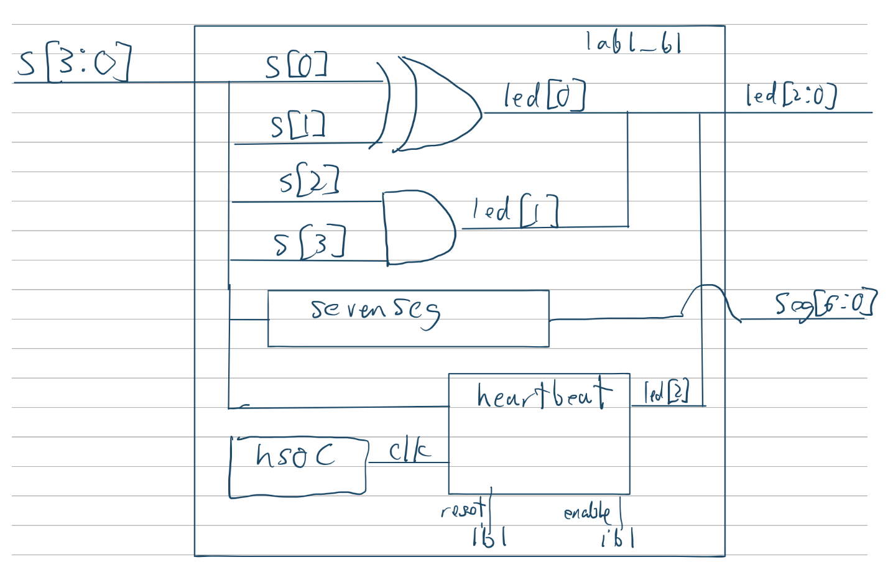
:::
The block diagram in figure 1 shows the top level module lab1_bl and its 3 included sub-modules. Sevenseg which decodes the 4 bit input to a 7 bit output for the seven segment display, heartbeat which implements the flashing led, and HSOC which generates a 48mhz clock signal from the onboard oscilator. The top level module also includes assign statements used to control the other on-board leds as their respective logic gates.

### Schematic
::: {.callout-note collapse="true"}
## Expand to see schematic
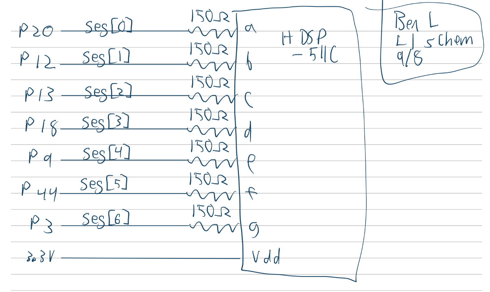
:::
Figure 2 shows how the seven segment display was physically connected to the dev board. Each led cathode has a current limiting resistor of 150ohms to limit the current within 8mA (recommended by prof Spencer in lecture).

### Calculations
::: {.callout-note collapse="true"}
## Expand to see calculations
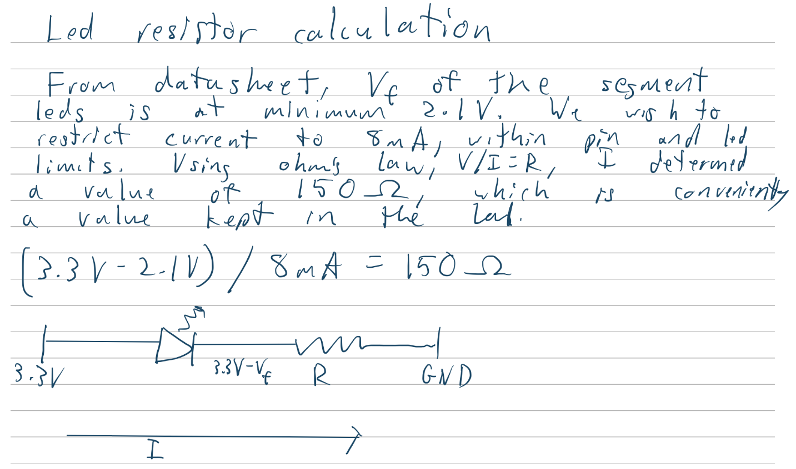

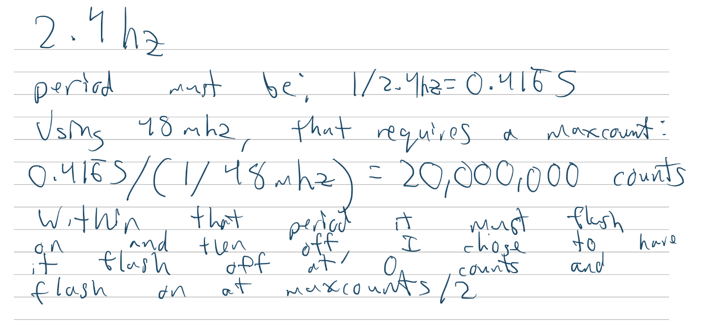
:::
## Results and Discussion

### Testbench Simulation
::: {.callout-note collapse="true"}
## Expand to see waveforms (clearer images in the repository)
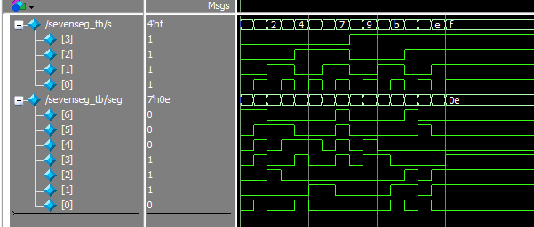

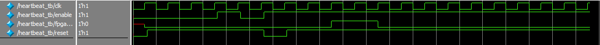

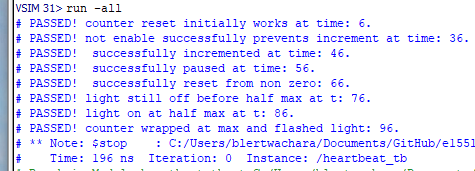

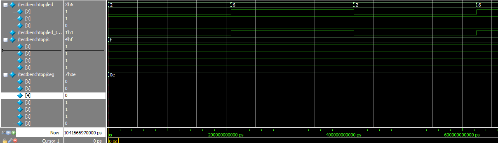

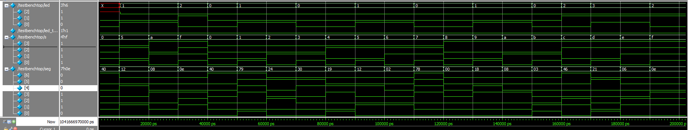

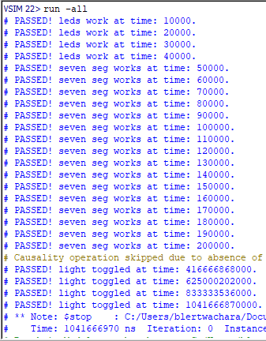

:::

The design met all intended design objectives. 

## Reflection
This lab took about 22 hours. The board assembly did not take as long as I expected, instead, most of the time was spent debugging testbenches and trying to parse requirements from the spec sheet. My system verilog skills are definitely a little rough, but I think I was able to relearn a lot during this lab.

### AI Prototype Summary

Prompt: "Write SystemVerilog HDL to leverage the internal high speed oscillator in the Lattice UP5K FPGA and blink an LED at 2 Hz. Take full advantage of SystemVerilog syntax, for example, using logic instead of wire and reg"

Model: "gemini flash 3.6"

::: {.callout-note collapse="true"}
## Expand to see AI output:
// Top-level module for Lattice iCE40UP5K LED blinker using internal HSOSC
module led_blink_top (
    output logic led // Output connected to an external or onboard LED
);

    // ------------------------------------------------------------------------
    // Internal Oscillator Primitive Instantiation
    // ------------------------------------------------------------------------
    logic clk_48mhz;

    // HSOSC Primitive Settings:
    // CLKHF_DIV = "0b00" -> 48 MHz (Default)
    //             "0b01" -> 24 MHz
    //             "0b10" -> 12 MHz
    //             "0b11" -> 6 MHz
    HSOSC #(
        .CLKHF_DIV("0b00")
    ) hsosc_inst (
        .CLKHFPU(1'b1),      // Power-up signal: 1 = Oscillator active, 0 = Power down
        .CLKHFEN(1'b1),      // Enable signal: 1 = Output enabled
        .CLKHF(clk_48mhz)    // 48 MHz output clock signal
    );

    // ------------------------------------------------------------------------
    // 2 Hz LED Blink Generator
    // ------------------------------------------------------------------------
    // Target Frequency: 2 Hz (Toggle rate: 4 Hz -> Every 12,000,000 clock cycles)
    // Formula: Threshold = (Clock Frequency / (2 * Target Frequency)) - 1
    // Threshold = (48,000,000 / 4) - 1 = 11,999,999
    
    localparam int unsigned CLK_FREQ   = 48_000_000;
    localparam int unsigned TOGGLE_CNT = (CLK_FREQ / 4) - 1;

    // 24 bits are required to store up to 11,999,999 (2^24 - 1 = 16,777,215)
    logic [23:0] counter = '0;

    always_ff @(posedge clk_48mhz) begin
        if (counter == TOGGLE_CNT) begin
            counter <= '0;
            led     <= ~led; // Toggle LED state
        end else begin
            counter <= counter + 1'b1;
        end
    end

endmodule
:::
The system verilog succesfully synthesized and generated the following block diagram:
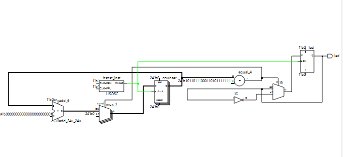

The output seems somewhat similar to something I could write, although the integrated math to calculate the threshold seems more precise than what I did. I also have not used localparam before, but it seems to be a way to make local constants. I think a common module like this is probably a trivial task for the mainstream llms. I would be interested in seeing how well they can handle really complex modules that depend on more libraries and if they can make thorough test benches. Maybe an llm could even help fix Radiant and make it not bad.