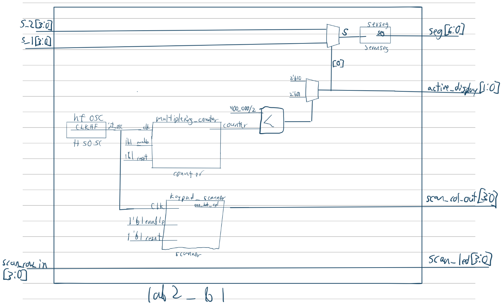
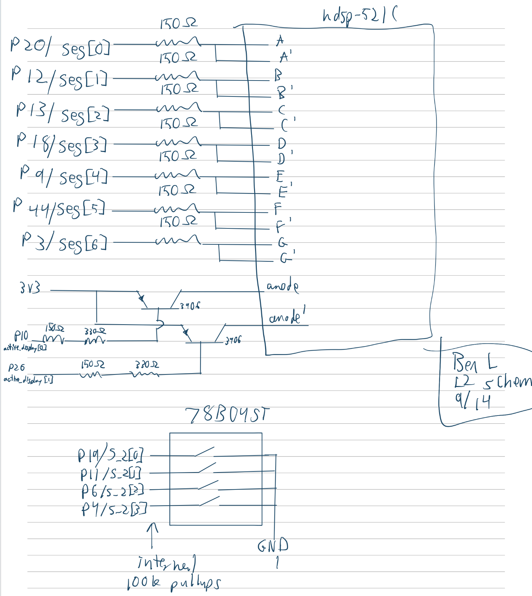
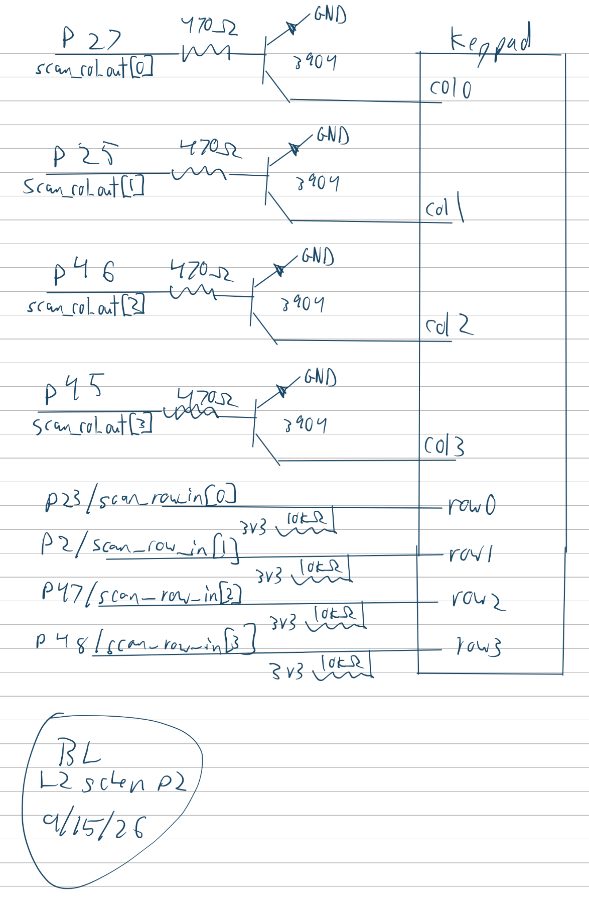
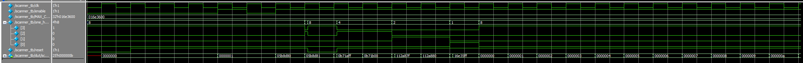
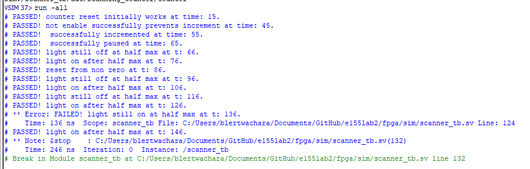
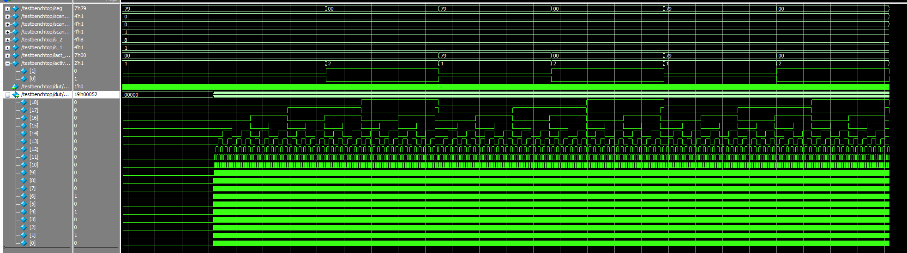
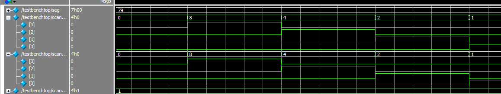
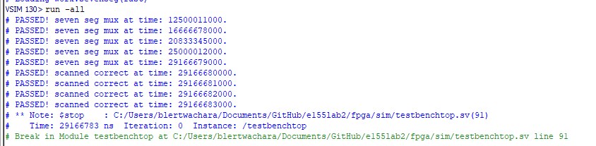

## Introduction
In this lab, time multiplexing was implemented to display distinct values on two 7 segment displays using only 9 signal lines. A 4x4 keypad was also implemented with a scanning module so that when any key was pressed, a light specific to its column would flash with a phase offset specific to its row. PNP transistors were used to control the common anode of the 7 segment displays and NPN transistors were used to prevent shorting FPGA output pins when keys were pressed.
## Hardware

## Design and Testing Methodology
A scanning module was created to send a pulse to each column of the keypad sequentially (2hz for full scan). This was done using a counter divided into 4 regions (one region per column). In the top level module, the return signals from the keypad rows are assigned to 4 LED signals. An additional counter was used to generate a 240hz signal to multiplex the displays, switching between which input was decoded and which display was given power. 

## Technical Documentation
The source code and all figures for the project can be found in the associated [Github repository](https://github.com/Jebeandiah/e155lab2/tree/main)

### Block Diagram
::: {.callout-note collapse="true"}
## Expand to see block diagram

:::

### Schematic
::: {.callout-note collapse="true"}
## Expand to see schematic

:::

### Calculations
::: {.callout-note collapse="true"}
## Expand to see calculations
The seven segment displays were set to refresh at 120hz using a max count calculated like so: $${48000000hz / 120hz = 400000 counts}$$

The scanning signal was set to scan each column at 2hz using a max count calculated like so: $${48000000hz / 2hz = 24000000 counts}$$

:::
## Results and Discussion

### Testbench Simulation
::: {.callout-note collapse="true"}
## Expand to see waveforms (clearer images in the repository)

:::

The design met all intended design objectives. 

## Reflection
This lab took about 15 hours. As with the last lab, most of the time was spent debugging testbenches and trying to parse requirements from the spec sheet. I do think I was more efficient with the testbenches, but I still had to spend a lot of time fixing bugs. The specs and lab manual were even more confusing this week. I feel like many aspects of the instructions and specs were unnecessarily mysterious. Even in the context of leaving room for students to figure things out on their own, I am a little baffled at why some information was left out. For example, the keypad light output didn't even specify how many lights should be used (It's obvious if just directly assigning the inputs to the outputs that it should be 4, but its not clear what the intended outcome even is). The amount of pins this lab requires also did not seem to be a consideration, althought I imagine thasts due to the last minute additions from lab 3.

### AI Prototype Summary

Prompt 1 (outside of context): "Write SystemVerilog HDL to time multiplex a single seven segment decoder (that decodes from four bits to a common anode seven segment display) to decode two sets of input bits and drive two sets of seven output bits."

Model: "gemini flash 3.6"

::: {.callout-note collapse="true"}
## Expand to see AI output:
module top_display_mux #(
    parameter CLK_FREQ = 50_000_000 // 50 MHz input clock
) (
    input  logic       clk,
    input  logic       rst_n,      // Active-low asynchronous reset
    input  logic [3:0] in_digit0,  // First 4-bit BCD input
    input  logic [3:0] in_digit1,  // Second 4-bit BCD input
    output logic [6:0] seg,        // Seven-segment output (Active LOW: {g,f,e,d,c,b,a})
    output logic [1:0] digit_an    // Digit enable anodes (Active LOW: [1] = Digit 1, [0] = Digit 0)
);

    // ------------------------------------------------------------------------
    // 1. Clock Divider for Refresh Rate (~1 kHz toggle rate / ~500 Hz full cycle)
    // ------------------------------------------------------------------------
    localparam CNT_MAX = (CLK_FREQ / 1000) - 1;
    localparam CNT_WIDTH = $clog2(CNT_MAX + 1);

    logic [CNT_WIDTH-1:0] refresh_counter;
    logic                 digit_select;

    always_ff @(posedge clk or negedge rst_n) begin
        if (!rst_n) begin
            refresh_counter <= '0;
            digit_select    <= 1'b0;
        end else if (refresh_counter == CNT_MAX) begin
            refresh_counter <= '0;
            digit_select    <= ~digit_select; // Alternate active digit
        end else begin
            refresh_counter <= refresh_counter + 1'b1;
        end
    end

    // ------------------------------------------------------------------------
    // 2. Anode Control (Active-Low Common Anodes)
    // ------------------------------------------------------------------------
    always_comb begin
        case (digit_select)
            1'b0:    digit_an = 2'b10; // Enable Digit 0 (Active Low)
            1'b1:    digit_an = 2'b01; // Enable Digit 1 (Active Low)
            default: digit_an = 2'b11; // Turn off both
        endcase
    end

    // ------------------------------------------------------------------------
    // 3. Input Multiplexer
    // ------------------------------------------------------------------------
    logic [3:0] selected_digit;

    assign selected_digit = (digit_select == 1'b0) ? in_digit0 : in_digit1;

    // ------------------------------------------------------------------------
    // 4. Shared Seven-Segment Decoder Instance
    // ------------------------------------------------------------------------
    seven_seg_decoder_ca u_decoder (
        .bcd(selected_digit),
        .seg(seg)
    );

endmodule

// ============================================================================
// Single 4-bit to Common Anode Seven Segment Decoder
// Mapping: seg[6]=g, seg[5]=f, seg[4]=e, seg[3]=d, seg[2]=c, seg[1]=b, seg[0]=a
// ============================================================================
module seven_seg_decoder_ca (
    input  logic [3:0] bcd,
    output logic [6:0] seg // Active LOW outputs (0 = segment ON, 1 = segment OFF)
);

    always_comb begin
        case (bcd)
            4'h0: seg = 7'b100_0000; // 0
            4'h1: seg = 7'b111_1001; // 1
            4'h2: seg = 7'b010_0100; // 2
            4'h3: seg = 7'b011_0000; // 3
            4'h4: seg = 7'b001_1001; // 4
            4'h5: seg = 7'b010_0100; // 5
            4'h6: seg = 7'b000_0010; // 6
            4'h7: seg = 7'b111_1000; // 7
            4'h8: seg = 7'b000_0000; // 8
            4'h9: seg = 7'b001_0000; // 9
            4'hA: seg = 7'b000_1000; // A
            4'hB: seg = 7'b000_0011; // b
            4'hC: seg = 7'b100_0110; // C
            4 me: seg = 7'b010_0001; // d
            4'hE: seg = 7'b000_0110; // E
            4'hF: seg = 7'b000_1110; // F
            default: seg = 7'b111_1111; // Blank display
        endcase
    end

endmodule
:::
Astoundingly, the output had a syntax error. I've done a lot of vibe-coding, and never had and ai output with a blatant syntax error like this, where it strays from a pattern that it clearly is capable of writing. It almost seems just like a typo.

Otherwise, the output is very similar to what I wrote, and doesn't use any particularly advanced features of system verilog.

Prompt 2 (In-context): "Write SystemVerilog HDL to time multiplex a single seven segment decoder (that decodes from four bits to a common anode seven segment display) to decode two sets of input bits and drive two sets of seven output bits. Use the seven segment decoder and oscillator provided in the attached files."

Model: "gemini flash 3.6"

::: {.callout-note collapse="true"}
## Expand to see the in-context AI output:
module top_mux_sevenseg #(
    parameter REFRESH_COUNT = 100_000 // Adjust based on clk frequency for display refresh (~100Hz-1kHz)
) (
    input  logic       clk,
    input  logic       reset, // Active low, matching counter module logic
    input  logic [3:0] s0,
    input  logic [3:0] s1,
    output logic [6:0] seg0,
    output logic [6:0] seg1
);

    // Counter output signals
    logic [24:0] count;
    
    // Instantiate oscillator/counter module
    // Uses active-low reset and continuous enable[cite: 1]
    counter #(
        .MAX_COUNT(REFRESH_COUNT),
        .COUNTER_WIDTH(25)
    ) clk_div (
        .clk(clk),
        .reset(reset),
        .enable(1'b1),
        .counter(count)
    );

    // State signal to alternate multiplexing phase
    logic mux_sel;

    // Toggle multiplexer state when the counter rolls over
    always_ff @(posedge clk) begin
        if (!reset) begin
            mux_sel <= 1'b0;
        end else if (count == REFRESH_COUNT - 1) begin
            mux_sel <= ~mux_sel;
        end
    end

    // Input multiplexer to shared decoder
    logic [3:0] current_s;
    assign current_s = (mux_sel) ? s1 : s0;

    // Shared 7-segment decoder instance
    logic [6:0] decoded_seg;
    sevenseg decoder (
        .s(current_s),
        .seg(decoded_seg)
    );

    // Output registers/latches to hold segment values for each display
    always_ff @(posedge clk) begin
        if (!reset) begin
            seg0 <= 7'b1111111; // Blank display (active-low output)
            seg1 <= 7'b1111111;
        end else begin
            if (mux_sel == 1'b0) begin
                seg0 <= decoded_seg;
            end else begin
                seg1 <= decoded_seg;
            end
        end
    end

endmodule
:::
This time, as expected, the output is syntactically correct. It does things quite differently from my impleentation, using an additional 2 flops in the top module.
