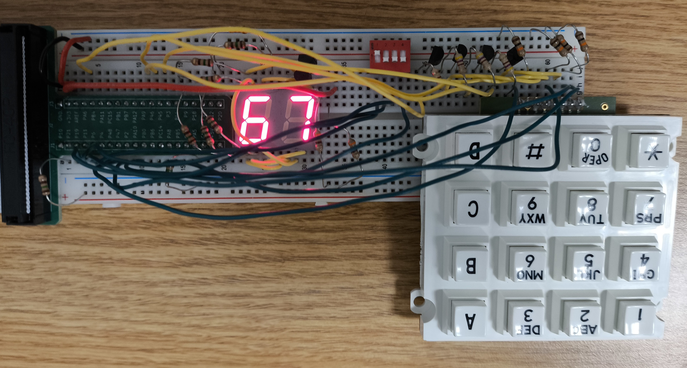
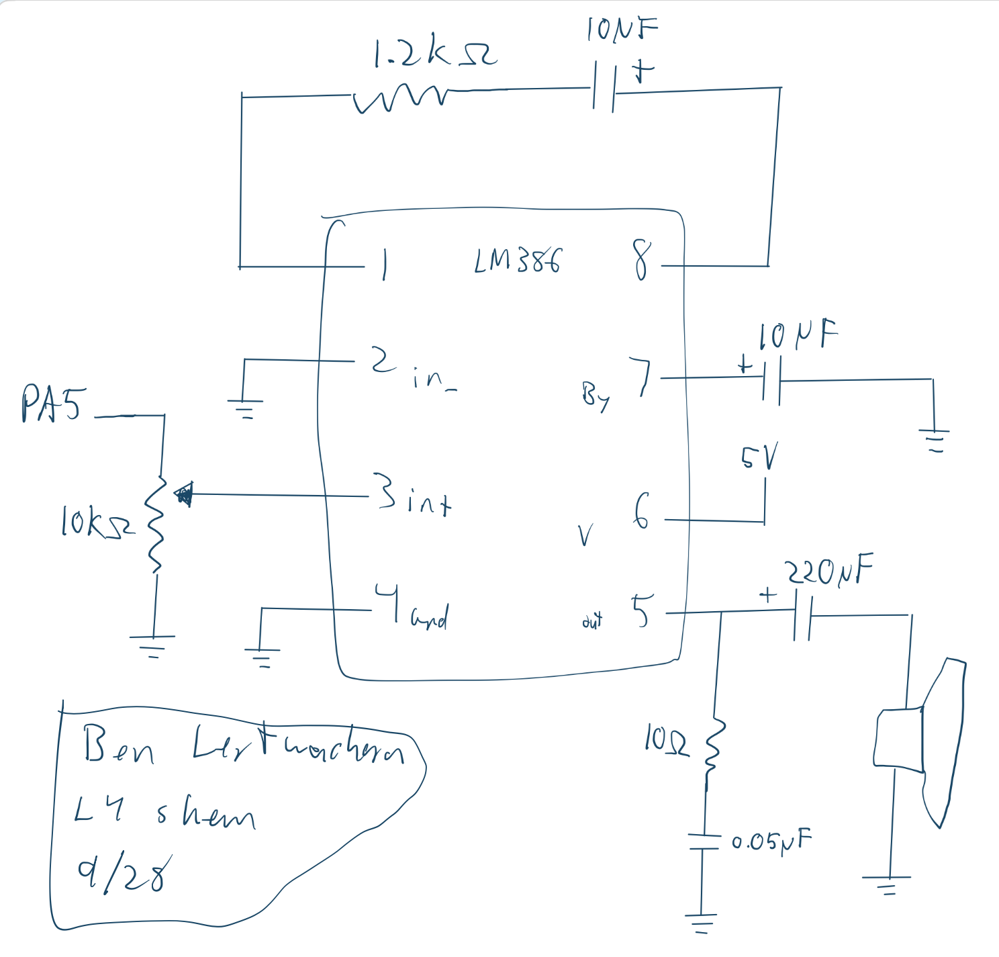
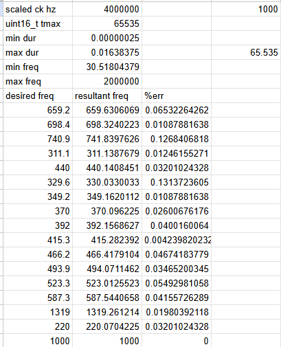

## Introduction
In this lab, square wave generation was implmented on a STM32L432KC microcontroller using a hardware timer to toggle a gpio pin. Modifying the arr register of the timer allowed us to control the frequency of thee output wavee, which was combined with an aditional timer to play specific tones for specific durations.
## Hardware

## Design and Testing Methodology
I just used TIM6 and TIM7 because they seemed easy to use.

The design of the amplifier circuit I also just took from the LM386 datasheet.

My wait function sets the prescaler adaptively depending on whether you need ms or micros level accuracy. If you input micros cleanly describes a ms duration, it will use a prescaler of 4000, resulting in an effective clock of 1khz. Otherwise, the prescaler it just 1 for an effective clock of 4mhz. I did this since the tmax of a uint16_t did not allow for the counter to count to the note durations with a 4mhz effective clock.

## Technical Documentation
The source code and all figures for the project can be found in the associated [Github repository](https://github.com/Jebeandiah/e155lab4/tree/main)

### Schematic
::: {.callout-note collapse="true"}
## Expand to see schematic

:::

### Calculations
::: {.callout-note collapse="true"}
## Expand to see calculations
At 4mhz, the desired max count for a specific frequency is calculated like so: counts = FLOOR(500,000/ROUND(freq))*4-1    (Rounded since note entries are ints, and floored for integer division)

This translate to a resultant frequency of: resultant freq = 4mhz/(counts+1)/2   (Divided by 2 since we are toggling twice per period)

I used these formulas to determine the percent error in the actual frequencies used in Fur Elise:

Those results can be found in the linked spreadsheet: [Google Sheet](https://docs.google.com/spreadsheets/d/1bdiveE-bJ4azX_MM3s40cBUJDy62LTZ2wcs9B6Dgh84/edit?usp=sharing)

All resultant frequencies were well within 1% error of the desired frequency. If you don't consider the beforehand rounding, you don't need to calculate individual errors since the counter should be accurate toa certain factor, in my case to the microseconds. Around 220hz that has a worst case error of: $(10^{-6})*220*100*2 = 0.044$%

And at 1khz:  $(10^{-6})*1000*100*2 = 0.2$%

:::
## Results and Discussion

The design met all intended design objectives. 

### Reflection
This lab took about 15 hours. Most of my time was spent rewriting my code to better fit the three FSM types. 

The specs were bad. I don't understand how specs that were derived from clear requirements in someone's head end up missing so many critical details. Why am I trying to follow these specs when there are countless caveats and interactions with things said from class that affect how they should be implemented. I think the worst offender this week were the specs concerning the block diagrams. I don't think a single person will make their diagrams as the specs seem to dictate, and those specs only start to make sense in conjunction with information that Prof. Spencer presented on the lab check in day. Also, I don't remember if there were other resources, but the lab report template has an incomplete block diagram and schematic.

I also think the amount I learn during lab really drops off after a certain amount of time. For the first 8 or so hours, I am engaged and trying new things and trying to improve. Past that, my focus really shifts to just checking off boxes. At that point, I was restructuring my verilog, finishing up test benches, and doing all the diagrams. I think most of these deliverables ended up being decent, but I really did not care about doing them well or deeply learning about how they interacted with my system. 

### AI Prototype Summary

Prompt 1: 

::: {.callout-note collapse="true"}
## Expand to see prompt:
"What timers should I use on the STM32L432KC to generate frequencies ranging from 220Hz to 1kHz? What’s the best choice of timer if I want to easily connect it to a GPIO pin? What formulae are relevant, and what registers need to be set to configure them properly?"
:::

Model: "gemini pro 3.1"

::: {.callout-note collapse="true"}
## Expand to see AI output:
For generating hardware-timed frequencies between 220Hz and 1kHz on the STM32L432KC, you must use a timer that includes physical Output Compare (OC) channels routed to the microcontroller's Alternate Function (AF) multiplexer.Basic timers (TIM6 and TIM7) lack physical output pins and cannot be used for this. You should choose from the Advanced-Control (TIM1) or General-Purpose (TIM2, TIM15, TIM16) timers.The Best Choice: TIM2TIM2 is the optimal choice for this frequency range. Unlike the 16-bit timers on this MCU, TIM2 is a 32-bit timer.Generating a low frequency like 220Hz from a high-speed system clock (e.g., 80 MHz) requires a large division factor. On a 16-bit timer, you are forced to use a hardware Prescaler to slow the clock down before it hits the timer, as the 16-bit Auto-Reload Register caps at 65,535. With TIM2's 32-bit register (capping at over 4.2 billion), you can leave the Prescaler at 0 and simply dump the raw division ratio straight into the Auto-Reload Register, yielding much higher frequency resolution.TIM2 is also extremely easy to route to GPIOs. For example, configuring PA0 or PA5 to Alternate Function 1 (AF1) maps them directly to TIM2_CH1.Relevant FormulaeTo configure the frequency, you need to calculate the values for the Prescaler (PSC) and the Auto-Reload Register (ARR). The timer triggers an update event and resets when it reaches the ARR value.The output frequency $f_{out}$ is determined by:$$f_{out} = \frac{f_{clk}}{(PSC + 1) \times (ARR + 1)}$$Where:$f_{clk}$ is the frequency of the APB clock feeding the timer (up to 80 MHz).$PSC$ is the 16-bit Prescaler register value.$ARR$ is the 32-bit (for TIM2) or 16-bit Auto-Reload Register value.If you want to generate a standard 50% duty cycle square wave (PWM), you must configure the Capture/Compare Register (CCR) to exactly half of the ARR value:$$CCR = \frac{ARR}{2}$$Tip for 16-bit timers (TIM15/16): Set the $PSC$ to $(f_{clk}\text{ in MHz} - 1)$ to create a 1 MHz timer clock. Then, $ARR = (\frac{1,000,000}{f_{out}}) - 1$.Required Register ConfigurationsTo output a hardware-controlled square wave on a GPIO pin (e.g., routing TIM2_CH1 to PA0), configure the following peripheral registers in order:1. Clock Enable RegistersRCC_APB1ENR1: Set the TIM2EN bit to enable the clock to TIM2.RCC_AHB2ENR: Set the GPIOAEN bit to enable the clock to the GPIOA port.2. GPIO Configuration Registers (GPIOA)GPIOx_MODER: Clear the bits for the target pin (PA0) and set them to 0b10 to enable Alternate Function Mode.GPIOx_AFRL (or AFRH): Set the Alternate Function selection multiplexer. For PA0 to act as TIM2_CH1, set the 4-bit AF field for Pin 0 to 0b0001 (AF1).3. Timer Time-Base Registers (TIM2)TIMx_PSC: Set your calculated Prescaler value.TIMx_ARR: Set your calculated Auto-Reload value to define the specific 220Hz – 1kHz frequency.4. Timer Output Compare/PWM Registers (TIM2)TIMx_CCMR1: Configure Channel 1 as an output and set its behavior.Set the OC1M (Output Compare 1 Mode) bits to 0b110 (PWM Mode 1). This pulls the pin HIGH while the counter is below CCR1, and LOW when it is above.Set the OC1PE bit to enable preload on the CCR1 register (ensures clean duty cycle transitions if you change the frequency dynamically).TIMx_CCR1: Write $ARR / 2$ to this register to set a 50% duty cycle.TIMx_CCER: Set the CC1E (Capture/Compare 1 Output Enable) bit to physically connect the timer's internal signal to the GPIO pin.5. Start the TimerTIMx_CR1: Set the CEN (Counter Enable) bit to start the timer.(Note: If you decide to use TIM1, TIM15, or TIM16 instead of TIM2, you must also set the MOE (Main Output Enable) bit in the TIMx_BDTR (Break and Dead-Time Register) before the signal will physically appear on the pin.)
:::
I chose to use the simple timers that can't directly generate PWM signals on the GPIO, so the AI's thought process is quite different than mine. I do know a lot of people did choose to use TIM2, so they probably went through a similar thought process. It would have been nice to have a 32 bit counter and ARR, so even without using the PWM capability I can see why it would choose this timer.

