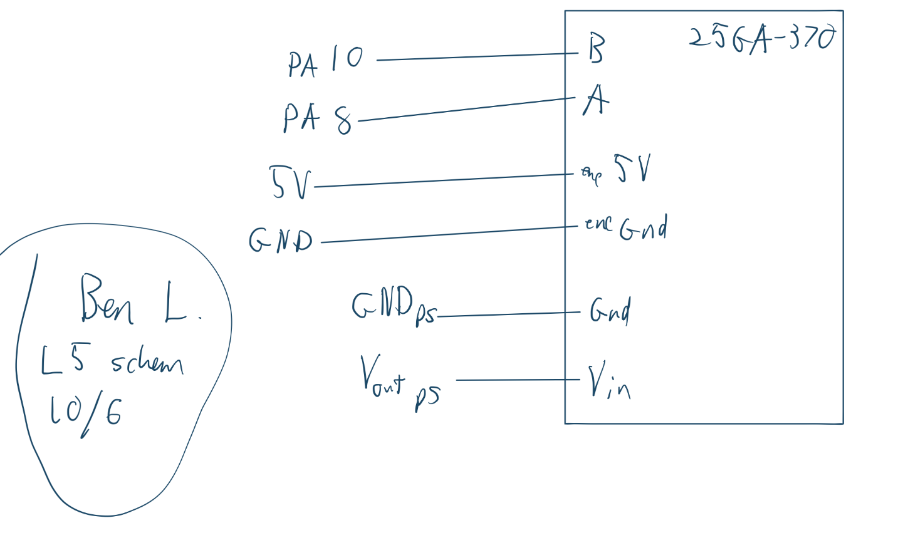
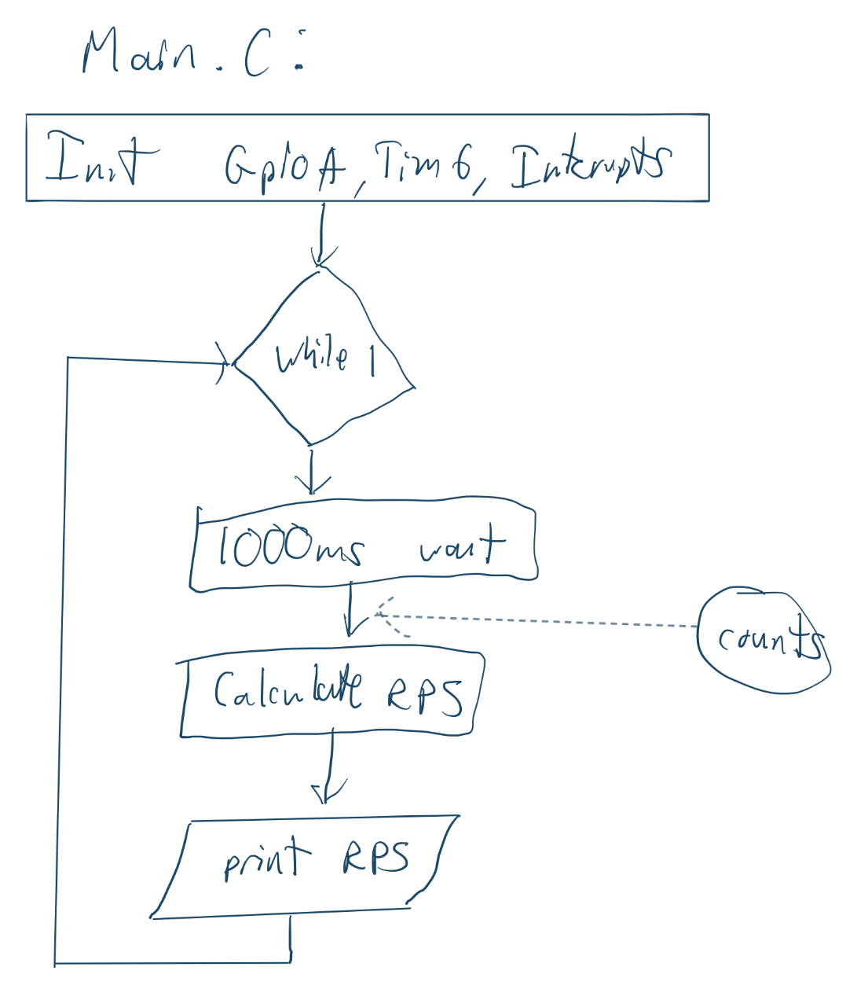
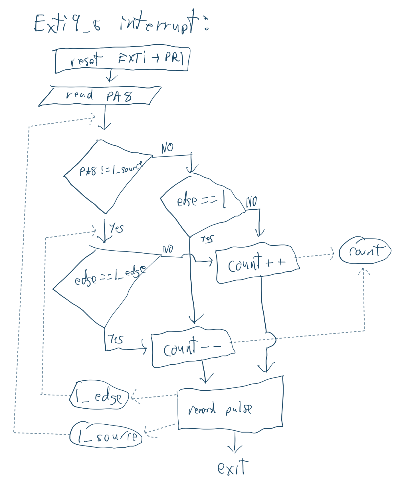
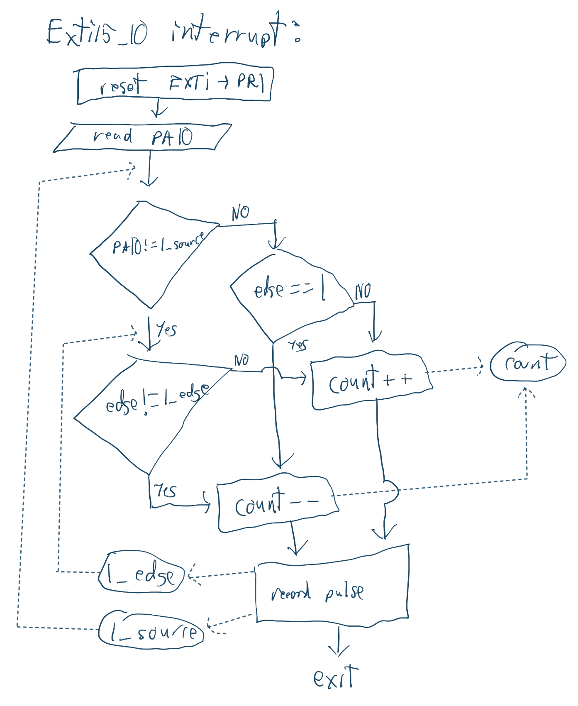

## Introduction
In this lab, incremental encoder count decoding was implemented using GPIO interrupts on an stm32l432kc microcontroller.

## Design and Testing Methodology
I set interrupts on both both edges of the A and B channels of the decoder. To calculate rps, I tallied the number of pulses over a specific interval (1s) since each pulse corresponds to a constant portion of a rotation. The system I used to determine the direction of rotation took the last two pulses and based on the pins and edge they triggered on, decoded a direction. For example, if you change directions, you pass over the same edge twice, so you get consecutive pulses from the same pin and the final edge determines the direction. 

## Technical Documentation
The source code and all figures for the project can be found in the associated [Github repository](https://github.com/Jebeandiah/e155lab5/tree/main)

### Schematic
::: {.callout-note collapse="true"}
## Expand to see schematic

:::
### Flow Charts
::: {.callout-note collapse="true"}
## Expand to see schematic

:::

### Calculations
::: {.callout-note collapse="true"}
## Expand to see calculations
The RPS calculation is based on the period of your tally loop (t), counts, (c), and pulses per rotation (p). The pulses per rotation is a count of rising edges on a single channel per rotation, so in our scheme, you get a total of 4c counts per rotation (Both edges on both channels).  

$$RPS = \frac{c}{4 \cdot t \cdot p} $$

To achieve an update rate of 1Hz, I set the prescaler to 4000 (3999) for an effective clock of 1khz. Then i set the auto reload register to 1000 (999) for a 1 second period.

With this update rate, the resolution of the measurement is bounded by the resolution a single count provides: $$\frac{1}{4 \cdot t \cdot p} $$ Which is 0.002083 RPS for the 120ppr encoder.

If I instead used polling to count pulses, the polling loop would need an update rate of at least 480*10 = 4800Hz to avoid missing pulses at 600rpm (12v) and you can still miss a pulse when you change directions. Even if the motor is spinning at a lower speed, you always need to a poll at a rate tat can accomodate your maximum speed. Missing pulses is particularly bad with my system, since it depends on consecutive pulses to determine direction.This is a lot more overhead than just using interrupts, which only trigger when a pulse occurs. However, polling in a software loop does make your loop execution more deterministic and is less of a black box than the interrupts. I'm not really sure how to evaluate the performance of the interrupt based system, but I think it depends on how long your ISR handling takes and how often its triggered.

:::
## Results and Discussion

The design met all intended design objectives. 

### Reflection
This lab took about 10 hours. Most of my time was spent debugging silly things like having gnd and 5v flipped on the encoder connector.  I think the specs were still strangely vague, particularly concerning the flow chart and performance comparison parts.

### AI Prototype Summary

Prompt 1: 

::: {.callout-note collapse="true"}
## Expand to see prompt:
"Write me interrupt handlers to interface with a quadrature encoder. I’m using the STM32L432KC, what pins should I connect the encoder to in order to allow it to easily trigger the interrupts?"
:::

Model: "gemini pro 3.1"

::: {.callout-note collapse="true"}
## Expand to see AI output:
To interface a quadrature encoder with the STM32L432KC, the most robust and efficient method is to use a hardware timer in Encoder Mode rather than writing manual external interrupt (EXTI) handlers for each phase edge. Hardware encoder mode automatically decodes the quadrature signals (Phase A and Phase B), tracks the direction, and updates an internal counter register without bogging down the CPU.   Recommended PinsThe best pins to use are PA0 and PA1, which correspond to TIM2_CH1 and TIM2_CH2 on the STM32L432KC:PA0: Connected to Encoder Phase A (TIM2_CH1)PA1: Connected to Encoder Phase B (TIM2_CH2)Implementation Code (STM32 HAL)Below is an example configuration using the STM32 HAL library to initialize TIM2 in encoder mode and read the position.1. Timer InitializationThis configuration sets up TIM2 to look at both input channels (TI1 and TI2) for maximum resolution (4x decoding).CTIM_HandleTypeDef htim2;

void MX_TIM2_Init(void)
{
    TIM_Encoder_InitTypeDef sConfig = {0};
    TIM_MasterConfigTypeDef sMasterConfig = {0};

    htim2.Instance = TIM2;
    htim2.Init.Prescaler = 0;
    htim2.Init.CounterMode = TIM_COUNTERMODE_UP;
    htim2.Init.Period = 65535; // Adjust based on your encoder's resolution
    htim2.Init.ClockDivision = TIM_CLOCKDIVISION_DIV1;
    htim2.Init.AutoReloadPreload = TIM_AUTORELOAD_PRELOAD_DISABLE;
    
    sConfig.EncoderMode = TIM_ENCODERMODE_TI12; // Count on both TI1 and TI2 edges (4x resolution)
    sConfig.IC1Polarity = TIM_ICPOLARITY_RISING;
    sConfig.IC1Selection = TIM_ICSELECTION_DIRECTTI;
    sConfig.IC1Prescaler = TIM_ICPSC_DIV1;
    sConfig.IC1Filter = 0; // Add filtering if your encoder signals are noisy
    
    sConfig.IC2Polarity = TIM_ICPOLARITY_RISING;
    sConfig.IC2Selection = TIM_ICSELECTION_DIRECTTI;
    sConfig.IC2Prescaler = TIM_ICPSC_DIV1;
    sConfig.IC2Filter = 0;
    
    if (HAL_TIM_Encoder_Init(&htim2, &sConfig) != HAL_OK)
    {
        // Initialization error handler
        Error_Handler();
    }

    sMasterConfig.MasterOutputTrigger = TIM_TRGO_RESET;
    sMasterConfig.MasterSlaveMode = TIM_MASTERSLAVEMODE_DISABLE;
    if (HAL_TIMEx_MasterConfigSynchronization(&htim2, &sMasterConfig) != HAL_OK)
    {
        Error_Handler();
    }
}
2. GPIO Configuration Function (Usually generated by CubeMX)Cvoid HAL_TIM_Encoder_MspInit(TIM_HandleTypeDef* tim_encoderHandle)
{
    GPIO_InitTypeDef GPIO_InitStruct = {0};
    if(tim_encoderHandle->Instance == TIM2)
    {
        // Enable GPIOA clock
        __HAL_RCC_GPIOA_CLK_ENABLE();
        // Enable TIM2 clock
        __HAL_RCC_TIM2_CLK_ENABLE();

        /**TIM2 GPIO Configuration
        PA0     ------> TIM2_CH1
        PA1     ------> TIM2_CH2
        */
        GPIO_InitStruct.Pin = GPIO_PIN_0 | GPIO_PIN_1;
        GPIO_InitStruct.Mode = GPIO_MODE_AF_PP;
        GPIO_InitStruct.Pull = GPIO_PULLUP; // Optional: internal pull-ups if not on board
        GPIO_InitStruct.Speed = GPIO_SPEED_FREQ_HIGH;
        GPIO_InitStruct.Alternate = GPIO_AF1_TIM2;
        HAL_GPIO_Init(GPIOA, &GPIO_InitStruct);
    }
}
3. Starting the Encoder and Reading PositionIn your main() function, start the encoder timer and poll or read the counter value:   Cint main(void)
{
    HAL_Init();
    SystemClock_Config();
    MX_GPIO_Init();
    MX_TIM2_Init();

    // Start the encoder interface
    HAL_TIM_Encoder_Start(&htim2, TIM_CHANNEL_ALL);

    int16_t encoder_value = 0;

    while (1)
    {
        // Read the current position from the counter register
        encoder_value = (int16_t)__HAL_TIM_GET_COUNTER(&htim2);
        
        // Do something with encoder_value...
        
        HAL_Delay(100);
    }
}
If you prefer a visual walkthrough of setting this up inside STM32CubeIDE, you can check out this STM32 Timer Encoder Mode Tutorial.
:::

Follow up:

::: {.callout-note collapse="true"}
## Expand to see prompt:
"use interrupts"
:::

::: {.callout-note collapse="true"}
## Expand to see AI output:
volatile int32_t encoder_position = 0;

void HAL_GPIO_EXTI_Callback(uint16_t GPIO_Pin)
{
    if (GPIO_Pin == GPIO_PIN_0 || GPIO_Pin == GPIO_PIN_1)
    {
        uint32_t pinA = HAL_GPIO_ReadPin(GPIOA, GPIO_PIN_0);
        uint32_t pinB = HAL_GPIO_ReadPin(GPIOA, GPIO_PIN_1);

        if (GPIO_Pin == GPIO_PIN_0)
        {
            // Phase A changed: if A equals B, direction is one way, else the other
            if (pinA == pinB) {
                encoder_position--;
            } else {
                encoder_position++;
            }
        }
        else if (GPIO_Pin == GPIO_PIN_1)
        {
            // Phase B changed
            if (pinA == pinB) {
                encoder_position++;
            } else {
                encoder_position--;
            }
        }
    }
}
:::

IDK how to set up the HAL library it's trying to use, but it seems pretty similar in concept to what I did. The direction calculation might be wrong though.

