## Introduction
In this lab, reading inputs through scanning a 4x4 keypad was implemented, with values displayed to a multiplexed dual seven segment display. Debouncing, multipress handling, and final key rolloff were all implemented.
## Hardware

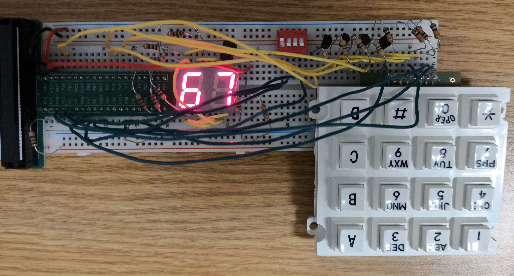

## Design and Testing Methodology
Debouncing Strategy: My debouncing strategy was to immediately register digit changes, but pause digit tracking for 50ms to avoid registering any additional bounces. For a simple strategy, I think this is pretty good since there isn't any added latency between press and register, so you can have a very long debounce time with less of a noticeable effect. However, it isn't perfect. A more complete debouncing strategy might continue to track digits during debouncing, and register presses that occured during the debounce time but after the initial digit resolved off.

FSM Design: There are some questionable elements of my FSM design. Primarily, before any inputs reach my main communicating FSM, they get processed by a very non-canonical FSM. This initial processing step tracks when single keys are pressed, when no keys are pressed, and decodes a digit from them. My main FSM is controlled by a three state canonical FSM (tracking, enable_shift, and debouncing). I use a counter (50ms) to move from the debouncing state to the tracking state. During the tracking state, my non_canonical digit tracker FSM is enabled. When it tracks a digit change, the control FSM moves from tracking to enable_shift. During enable_shift, my controller outputs an enable signal for my digit buffer, telling ti to shift a new digit onto the display. Enable_shift always moves immediately to debounce to ensure the digit only gets shifted once.  

## Technical Documentation
The source code and all figures for the project can be found in the associated [Github repository](https://github.com/Jebeandiah/e155lab3/tree/main)

### Block Diagrams
::: {.callout-note collapse="true"}
## Expand to see block diagram
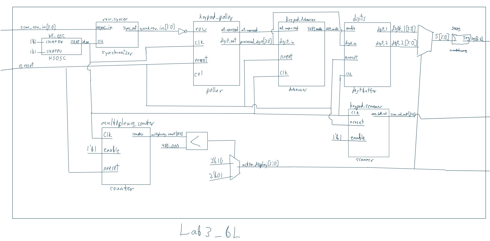

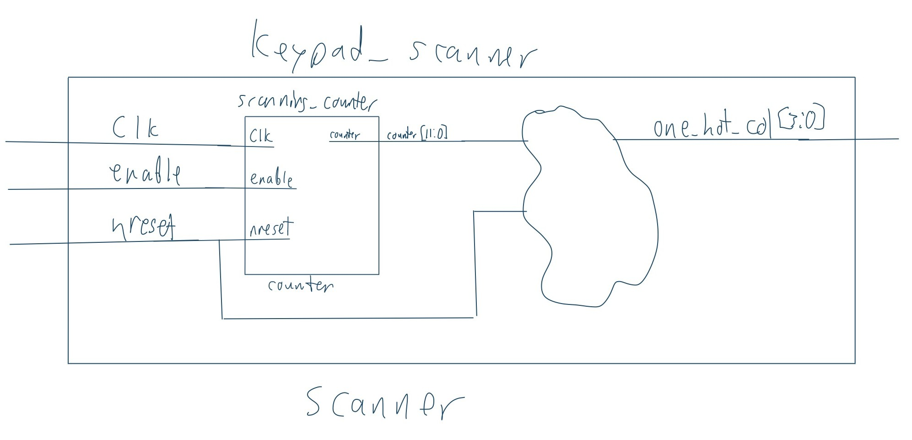

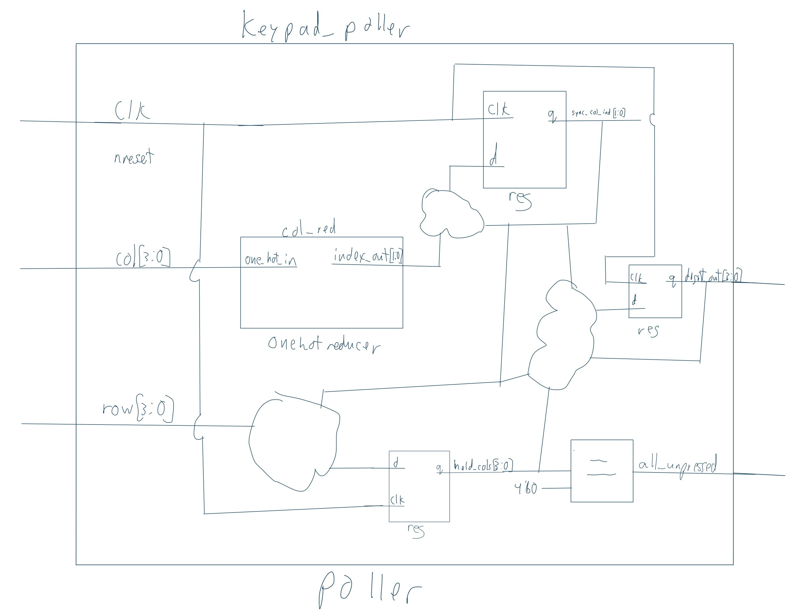

:::
### FSM Diagrams
::: {.callout-note collapse="true"}
## Expand to see FSM diagrams
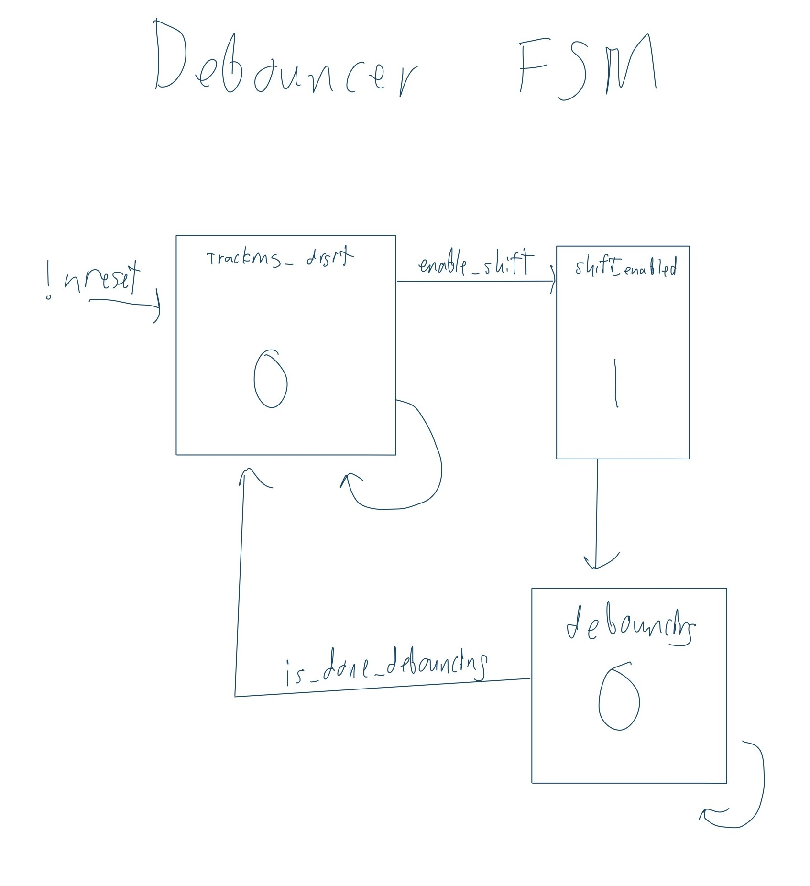

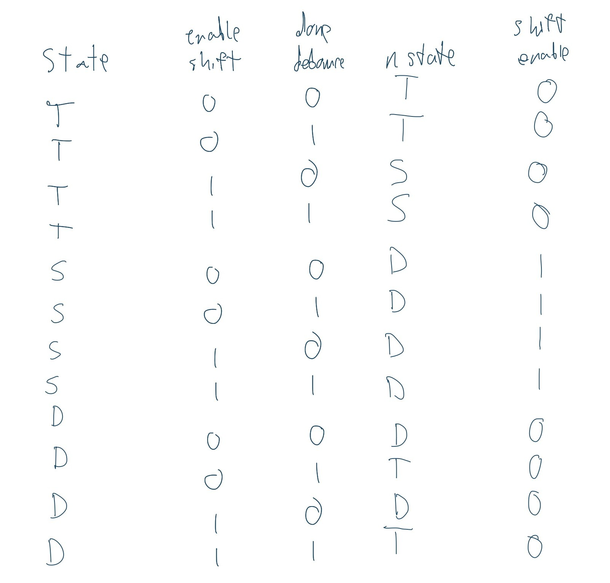

:::

### Schematic
::: {.callout-note collapse="true"}
## Expand to see schematic
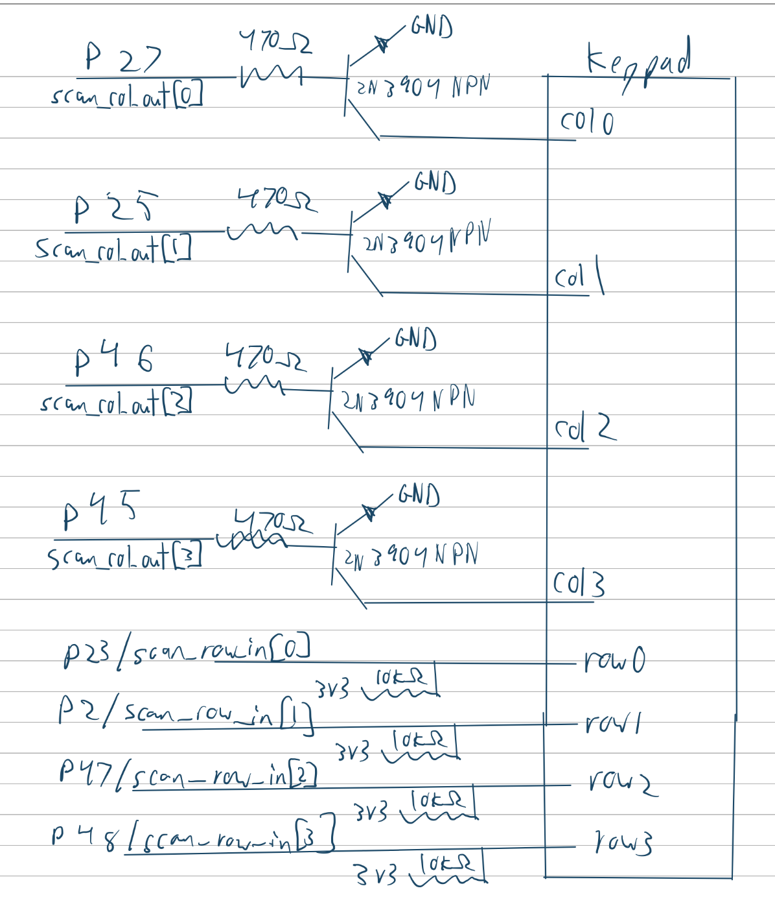
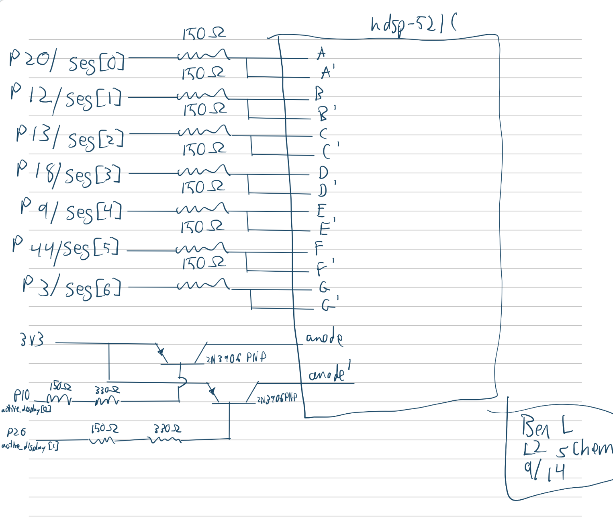
:::

### Calculations
::: {.callout-note collapse="true"}
## Expand to see calculations
The seven segment displays were set to refresh at 120hz using a max count calculated like so: $${48000000hz / 120hz = 400000 counts}$$

The debounce time was set to 50ms using a max count calculated like so: $${48000000hz * 0.05s = 2400000 counts}$$

The scanning rate was increased while inputs remained stable, resulting in a scanning rate of: $${48000000hz / 4096 counts = 11718.75hz}$$

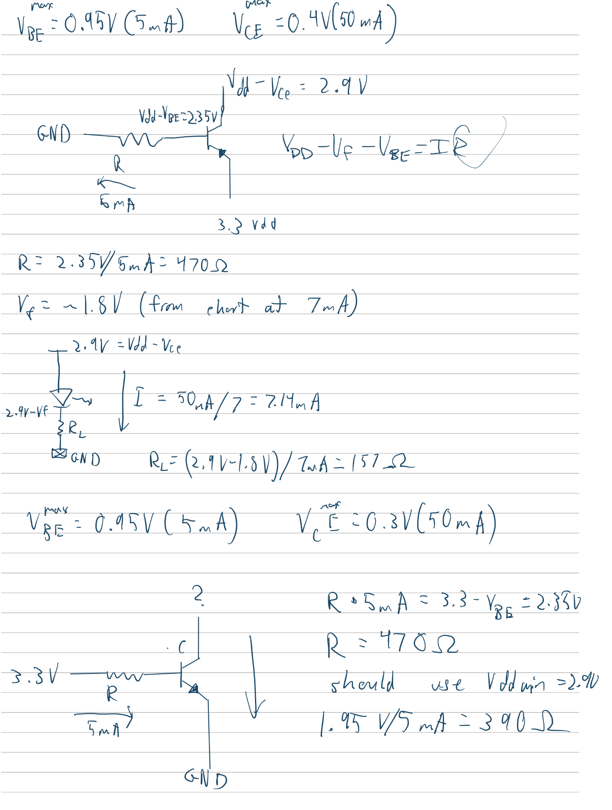
:::
## Results and Discussion

### Testbench Simulation
::: {.callout-note collapse="true"}
## Expand to see waveforms (clearer images in the repository)

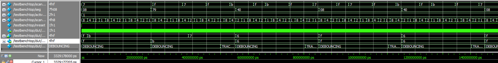

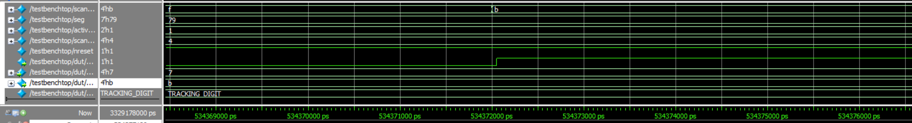

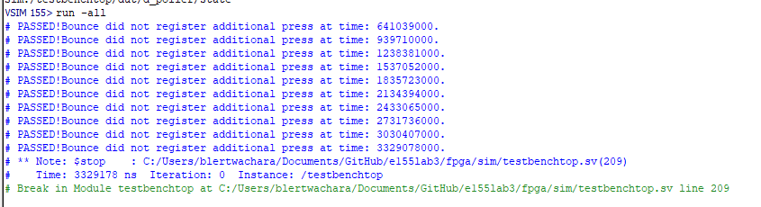

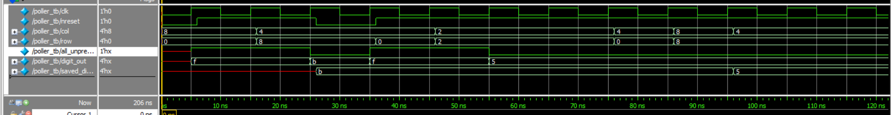

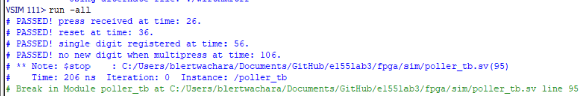

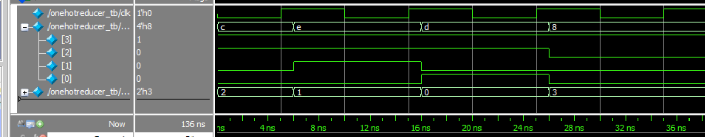

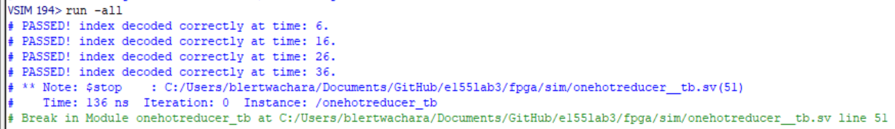

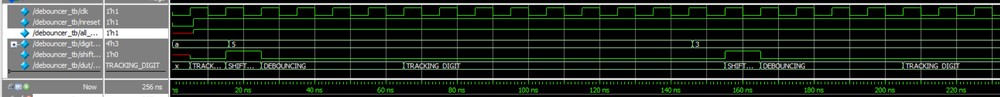

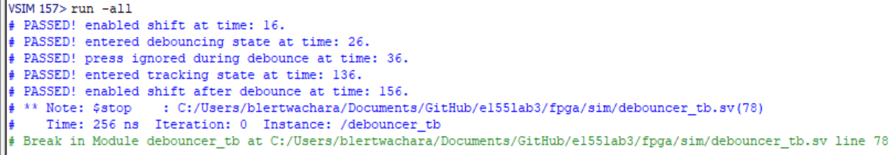

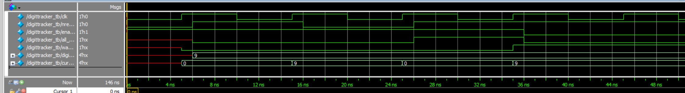

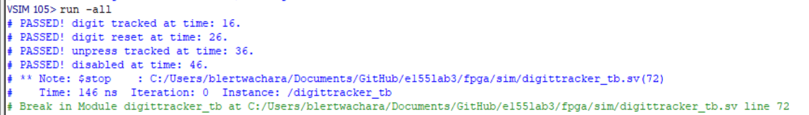

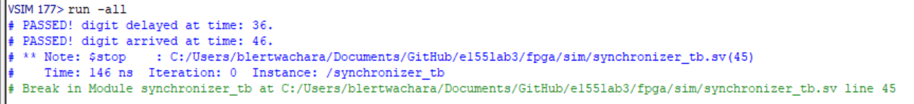

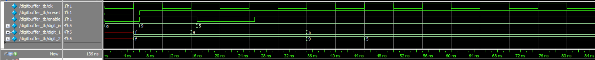

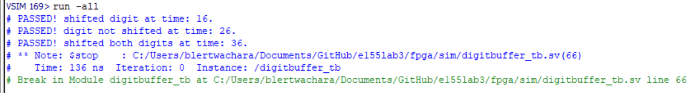

:::

The design met all intended design objectives. 

### Reflection
This lab took about 30 hours. Most of my time was spent rewriting my code to better fit the three FSM types. 

The specs were bad. I don't understand how specs that were derived from clear requirements in someone's head end up missing so many critical details. Why am I trying to follow these specs when there are countless caveats and interactions with things said from class that affect how they should be implemented. I think the worst offender this week were the specs concerning the block diagrams. I don't think a single person will make their diagrams as the specs seem to dictate, and those specs only start to make sense in conjunction with information that Prof. Spencer presented on the lab check in day. Also, I don't remember if there were other resources, but the lab report template has an incomplete block diagram and schematic.

I also think the amount I learn during lab really drops off after a certain amount of time. For the first 8 or so hours, I am engaged and trying new things and trying to improve. Past that, my focus really shifts to just checking off boxes. At that point, I was restructuring my verilog, finishing up test benches, and doing all the diagrams. I think most of these deliverables ended up being decent, but I really did not care about doing them well or deeply learning about how they interacted with my system. 

### AI Prototype Summary

Prompt 1: 

::: {.callout-note collapse="true"}
## Expand to see prompt:
"Target device: Lattice iCE40 UP5K FPGA with internal high-speed oscillator (~20 MHz).

Write synthesizable SystemVerilog to scan a 4x4 matrix keypad and display the last two hex keys pressed on a dual 7‑segment display. Implement:

A clock divider that derives a scan clock on the order of 100–200 Hz from the internal oscillator.
A keypad scanning controller that iterates one active‑low column at a time and samples active‑low rows, registering at most one key per press (debounce‑by‑design), ignoring additional presses while any key is held, and allowing a new registration only after release.
A top level that updates two hex digits (older and most recent) when a new key is registered and drives a time‑multiplexed two‑digit 7‑segment display without visible flicker and with balanced brightness.
Use idiomatic SystemVerilog (e.g., logic, always_ff, enumerated states for FSMs). Provide clean module boundaries and keep all state synchronous. Include brief comments explaining the design choices."
:::

Model: "gemini flash 3.6"

::: {.callout-note collapse="true"}
## Expand to see AI output:
module keypad_one_shot #(
    parameter integer CLK_FREQ_HZ   = 12_000_000, // Default 12 MHz internal oscillator
    parameter integer DEBOUNCE_MS   = 10          // Debounce settling time
)(
    input  logic       clk,
    input  logic       rst_n,
    
    // Inputs from Matrix Scanner / Raw Keypad Interface
    input  logic       key_pressed, // Asserted (1) when ANY key is currently down
    input  logic [3:0] raw_key_code,// Current key code from scanner
    
    // Keypad One-Shot Outputs
    output logic [3:0] key_code,   // Stable captured 4-bit key code
    output logic       key_valid   // Single-cycle high pulse on new key press
);

    // Calculate debounce counter threshold based on clock frequency
    localparam integer DEBOUNCE_CYCLES = (CLK_FREQ_HZ / 1000) * DEBOUNCE_MS;
    localparam integer TIMER_WIDTH     = $clog2(DEBOUNCE_CYCLES);

    // FSM State Encoding
    typedef enum logic [1:0] {
        ST_IDLE      = 2'b00, // Waiting for a key press
        ST_DEBOUNCE  = 2'b01, // Settling press/release bounce
        ST_REGISTER  = 2'b10, // Pulse key_valid and capture key_code
        ST_WAIT_RELEASE = 2'b11  // Hold until all keys are completely released
    } state_t;

    state_t state, next_state;

    // Registers
    logic [TIMER_WIDTH-1:0] timer_cnt;
    logic                   timer_expired;
    logic                   timer_rst;

    // -------------------------------------------------------------------------
    // 1. Debounce Counter
    // -------------------------------------------------------------------------
    assign timer_expired = (timer_cnt >= (DEBOUNCE_CYCLES - 1));

    always_ff @(posedge clk or negedge rst_n) begin
        if (!rst_n) begin
            timer_cnt <= '0;
        end else if (timer_rst) begin
            timer_cnt <= '0;
        end else if (!timer_expired) begin
            timer_cnt <= timer_cnt + 1'b1;
        end
    end

    // -------------------------------------------------------------------------
    // 2. FSM State & Output Registers (Sequential)
    // -------------------------------------------------------------------------
    always_ff @(posedge clk or negedge rst_n) begin
        if (!rst_n) begin
            state     <= ST_IDLE;
            key_code  <= 4'h0;
            key_valid <= 1'b0;
        end else begin
            state <= next_state;

            // Glitch-Free Registered Output Logic
            if (next_state == ST_REGISTER) begin
                key_valid <= 1'b1;
                key_code  <= raw_key_code; // Lock in the stable key code
            end else begin
                key_valid <= 1 me_b0; // Default to zero for all other states
            end
        end
    end

    // Fix small syntax typo in key_valid assignment
    // (Explicitly breaking down the state output register to avoid syntax edge-cases)

    // -------------------------------------------------------------------------
    // 3. FSM Next-State & Control Logic (Combinational)
    // -------------------------------------------------------------------------
    always_comb begin
        next_state = state;
        timer_rst  = 1'b0;

        case (state)
            ST_IDLE: begin
                if (key_pressed) begin
                    timer_rst  = 1'b1;
                    next_state = ST_DEBOUNCE;
                end
            end

            ST_DEBOUNCE: begin
                // If signal drops mid-debounce, return to idle (glitch / noise)
                if (!key_pressed) begin
                    next_state = ST_IDLE;
                end else if (timer_expired) begin
                    next_state = ST_REGISTER;
                end
            end

            ST_REGISTER: begin
                // Transition immediately after one clock cycle
                next_state = ST_WAIT_RELEASE;
            end

            ST_WAIT_RELEASE: begin
                // Lock out new keys until current key is completely released and stable
                if (!key_pressed) begin
                    timer_rst  = 1'b1;
                    // Require a debounced release before returning to IDLE
                    if (timer_expired) begin
                        next_state = ST_IDLE;
                    end
                end else begin
                    timer_rst = 1'b1; // Keep resetting timer while key is still held
                end
            end

            default: next_state = ST_IDLE;
        endcase
    end

endmodule

// SystemVerilog Keypad One-Shot Register & Debouncer
// Target: Lattice iCE40 UP5K (or general FPGA synthesizable)

module keypad_oneshot #(
    parameter integer CLK_FREQ_HZ   = 12_000_000, // Default 12 MHz iCE40 internal oscillator
    parameter integer DEBOUNCE_MS   = 10          // Debounce settling time in ms
)(
    input  logic       clk,
    input  logic       rst_n,          // Active-low asynchronous reset
    input  logic       key_valid,      // Driven high by scanner when a key is detected
    input  logic [3:0] raw_key_code,   // Current key code output from scanner

    output logic [3:0] key_code,       // Stable registered key code
    output logic       new_key_pulse   // High for exactly 1 clock cycle on valid key press
);

    // Calculate counter terminal count based on clock frequency
    localparam integer DEBOUNCE_CYCLES = (CLK_FREQ_HZ / 1000) * DEBOUNCE_MS;
    localparam integer COUNTER_WIDTH  = $clog2(DEBOUNCE_CYCLES);

    // State Encoding
    typedef enum logic [1:0] {
        ST_IDLE      = 2'b00, // Waiting for a key press
        ST_DEBOUNCE  = 2'b01, // Key detected; waiting for contacts to settle
        ST_PRESS_OUT = 2'b10, // Pulse registered; waiting for full release
        ST_RELEASE   = 2'b11  // Key released; waiting for release bounce to settle
    } state_e;

    state_e current_state, next_state;

    // Internal Registers
    logic [COUNTER_WIDTH-1:0] timer;
    logic                     timer_expired;
    logic [3:0]               latched_key;

    assign timer_expired = (timer >= (DEBOUNCE_CYCLES - 1));

    // -------------------------------------------------------------------------
    // 1. Debounce Timer Register
    // -------------------------------------------------------------------------
    always_ff @(posedge clk or negedge rst_n) begin
        if (!rst_n) begin
            timer <= '0;
        end else begin
            if (current_state == ST_DEBOUNCE || current_state == ST_RELEASE) begin
                if (!timer_expired) begin
                    timer <= timer + 1'b1;
                end
            end else begin
                timer <= '0;
            end
        end
    end

    // -------------------------------------------------------------------------
    // 2. State Transition Register
    // -------------------------------------------------------------------------
    always_ff @(posedge clk or negedge rst_n) begin
        if (!rst_n) begin
            current_state <= ST_IDLE;
        end else begin
            current_state <= next_state;
        end
    end

    // -------------------------------------------------------------------------
    // 3. Next State Logic (Combinational)
    // -------------------------------------------------------------------------
    always_comb begin
        next_state = current_state;

        case (current_state)
            ST_IDLE: begin
                if (key_valid) begin
                    next_state = ST_DEBOUNCE;
                end
            end

            ST_DEBOUNCE: begin
                if (!key_valid) begin
                    // False trigger or bounce back low
                    next_state = ST_IDLE;
                end else if (timer_expired) begin
                    // Press verified
                    next_state = ST_PRESS_OUT;
                end
            end

            ST_PRESS_OUT: begin
                if (!key_valid) begin
                    // Key released; debounce release phase
                    next_state = ST_RELEASE;
                end
            end

            ST_RELEASE: begin
                if (key_valid) begin
                    // Re-bounce or key still held
                    next_state = ST_PRESS_OUT;
                end else if (timer_expired) begin
                    // Fully released & settled
                    next_state = ST_IDLE;
                end
            end

            default: next_state = ST_IDLE;
        endcase
    end

    // -------------------------------------------------------------------------
    // 4. Glitch-Free Registered Outputs & Data Latching
    // -------------------------------------------------------------------------
    always_ff @(posedge clk or negedge rst_n) begin
        if (!rst_n) begin
            latched_key   <= 4'h0;
            new_key_pulse <= 1'b0;
        end else begin
            // Default single-cycle pulse low
            new_key_pulse <= 1'b0;

            // Latch key and fire one-shot pulse on successful press debounce transition
            if (current_state == ST_DEBOUNCE && next_state == ST_PRESS_OUT) begin
                latched_key   <= raw_key_code;
                new_key_pulse <= 1'b1;
            end
        end
    end

    assign key_code = latched_key;

endmodule
:::
The output synthesized correctly. This output is very different from what I would make design wise. It doesn't seem to do anything crazy technical though.

Prompt 2a: 

::: {.callout-note collapse="true"}
## Expand to see prompt
"Target device: Lattice iCE40 UP5K FPGA.

Overall Goal: Write SystemVerilog to scan a 4x4 matrix keypad and display the last two hex keys pressed on a dual 7 segment display.

Current Goal: Write a synthesizable SystemVerilog module that produces a one‑shot registration signal for the keypad system. Behavior:

When a key press is first detected, capture the current key code and assert a single‑cycle “new key” pulse.
While any key remains pressed, do not accept additional keys.
Only after keys are released should a subsequent press be recognized.
This should handle debouncing of the keys.
Implement as a small synchronous FSM with enumerated states and glitch‑free outputs. Keep names and interfaces reasonable; do not assume any hidden modules beyond what you define here."
:::

Prompt 2b: 

::: {.callout-note collapse="true"}
## Expand to see prompt
"Target device: Lattice iCE40 UP5K FPGA.

Write a synthesizable SystemVerilog module that cycles through keypad columns (active‑low, one at a time) and samples rows (active‑low) to detect a single key at a time. Behavior:

Iterate columns at a suitable scan rate derived from the divided clock and sample rows.
When a key is detected, report a stable key code consistent with a standard 4x4 keypad layout and maintain it while the key remains pressed.
Provide a boolean signal indicating whether any key is currently pressed.
Use clean state encoding and synchronous logic; avoid combinational feedback and latches."
:::

Prompt 2c: 

::: {.callout-note collapse="true"}
## Expand to see prompt
"Target device: Lattice iCE40 UP5K FPGA with internal oscillator as the root clock source.

Write a top‑level SystemVerilog module that instantiates the scanner and one‑shot modules, shifts the last two keys (older ← most recent; most recent ← new), and drives a multiplexed two‑digit seven‑segment display. Requirements:

Update the displayed digits only when a new key is registered.
Ensure equal apparent brightness and no visible flicker.
Keep all logic synthesizable and synchronous; use idiomatic SystemVerilog constructs.
Provide any small clock‑enable or divider logic you need. You can also assume that a sevenSegment module exists that takes a 4 bit input and outputs the 7 segments."
:::

::: {.callout-note collapse="true"}
## Expand to see the AI output:
module keypad_scanner #(
    parameter integer CLK_FREQ_HZ   = 12_000_000, // Default 12 MHz internal oscillator
    parameter integer SCAN_RATE_HZ  = 1_000       // Column scan frequency (1 kHz per step)
)(
    input  logic       clk,
    input  logic       rst_n,

    // Hardware Keypad Pins (Active-Low)
    // Note: Configure kp_rows as inputs with internal pull-ups in physical constraints (.pcf)
    input  logic [3:0] kp_rows,       // Active-Low row inputs
    output logic [3:0] kp_cols,       // Active-Low column drive outputs

    // Interface to One-Shot / Keypad Logic
    output logic [3:0] raw_key_code,  // Decoded 4-bit hex value (0x0 to 0xF)
    output logic       key_pressed    // High when ANY key is currently detected
);

    // -------------------------------------------------------------------------
    // 1. Clock Divider for Column Scanning (~1 kHz)
    // -------------------------------------------------------------------------
    localparam integer CLK_DIV_LIMIT = CLK_FREQ_HZ / SCAN_RATE_HZ;
    localparam integer DIV_WIDTH     = $clog2(CLK_DIV_LIMIT);

    logic [DIV_WIDTH-1:0] clk_div;
    logic                 scan_tick;

    always_ff @(posedge clk or negedge rst_n) begin
        if (!rst_n) begin
            clk_div   <= '0;
            scan_tick <= 1'b0;
        end else if (clk_div >= CLK_DIV_LIMIT - 1) begin
            clk_div   <= '0;
            scan_tick <= 1'b1;
        end else begin
            clk_div   <= clk_div + 1'b1;
            scan_tick <= 1 me_b0;
        end
    end

    // Fix typo in scan_tick zero assignment above
    // (Explicit register logic without bit syntax errors)

    // -------------------------------------------------------------------------
    // 2. Synchronizers for Asynchronous Row Inputs (2-Stage Flop)
    // -------------------------------------------------------------------------
    logic [3:0] rows_sync_0;
    logic [3:0] rows_sync_1;

    always_ff @(posedge clk or negedge rst_n) begin
        if (!rst_n) begin
            rows_sync_0 <= 4'hF;
            rows_sync_1 <= 4'hF;
        end else begin
            rows_sync_0 <= kp_rows;
            rows_sync_1 <= rows_sync_0;
        end
    end

    // -------------------------------------------------------------------------
    // 3. Column Ring Counter State Machine
    // -------------------------------------------------------------------------
    typedef enum logic [1:0] {
        COL_0 = 2'b00,
        COL_1 = 2'b01,
        COL_2 = 2'b10,
        COL_3 = 2'b11
    } col_state_t;

    col_state_t current_col;

    // Output active-low column selection based on current ring state
    always_comb begin
        case (current_col)
            COL_0:   kp_cols = 4'b1110;
            COL_1:   kp_cols = 4'b1101;
            COL_2:   kp_cols = 4'b1011;
            COL_3:   kp_cols = 4'b0111;
            default: kp_cols = 4'b1111;
        endcase
    end

    // -------------------------------------------------------------------------
    // 4. Matrix Scanning & Decode Logic
    // -------------------------------------------------------------------------
    logic [3:0] decoded_code;
    logic       row_active;

    // Detect if any row is pulled low (active-low signal)
    assign row_active = (rows_sync_1 != 4'b1111);

    // Map current active (Col, Row) intersection to 4-bit Hex code
    always_comb begin
        decoded_code = 4'h0;
        case (current_col)
            COL_0: begin
                case (rows_sync_1)
                    4'b1110: decoded_code = 4'h1; // Row 0
                    4'b1101: decoded_code = 4'h4; // Row 1
                    4'b1011: decoded_code = 4'h7; // Row 2
                    4'b0111: decoded_code = 4'hE; // Row 3 (*)
                    default: decoded_code = 4'h0;
                endcase
            end
            COL_1: begin
                case (rows_sync_1)
                    4'b1110: decoded_code = 4'h2; // Row 0
                    4'b1101: decoded_code = 4'h5; // Row 1
                    4'b1011: decoded_code = 4'h8; // Row 2
                    4'b0111: decoded_code = 4'h0; // Row 3 (0)
                    default: decoded_code = 4'h0;
                endcase
            end
            COL_2: begin
                case (rows_sync_1)
                    4'b1110: decoded_code = 4'h3; // Row 0
                    4'b1101: decoded_code = 4 me_h6; // Row 1
                    4'b1011: decoded_code = 4'h9; // Row 2
                    4'b0111: decoded_code = 4'hF; // Row 3 (#)
                    default: decoded_code = 4'h0;
                endcase
            end
            COL_3: begin
                case (rows_sync_1)
                    4'b1110: decoded_code = 4'hA; // Row 0
                    4'b1101: decoded_code = 4'hB; // Row 1
                    4'b1011: decoded_code = 4'hC; // Row 2
                    4'b0111: decoded_code = 4'hD; // Row 3
                    default: decoded_code = 4'h0;
                endcase
            end
            default: decoded_code = 4'h0;
        endcase
    end

    // -------------------------------------------------------------------------
    // 5. Sequential Update & Key Output Hold Logic
    // -------------------------------------------------------------------------
    always_ff @(posedge clk or negedge rst_n) begin
        if (!rst_n) begin
            current_col  <= COL_0;
            raw_key_code <= 4'h0;
            key_pressed  <= 1'b0;
        end else begin
            if (row_active) begin
                // Lock onto detected key press and update key output
                key_pressed  <= 1'b1;
                raw_key_code <= decoded_code;
                // Pause column scanning while key remains held
            end else begin
                key_pressed <= 1'b0;
                // Continue cycling through columns on scan ticks
                if (scan_tick) begin
                    current_col <= col_state_t'(current_col + 1'b1);
                end
            end
        end
    end

endmodule

module keypad_top (
    // External Reset Pin (Active-Low)
    input  logic       rst_n,

    // Hardware Keypad Matrix Pins
    input  logic [3:0] kp_rows,      // Active-Low row inputs (requires internal pull-ups in .pcf)
    output logic [3:0] kp_cols,      // Active-Low column outputs

    // Multiplexed Dual 7-Segment Display Pins
    output logic [6:0] seg,          // Segment outputs {g, f, e, d, c, b, a}
    output logic [1:0] digit_sel     // Digit select lines (Active-Low: [1]=Digit 1/Left, [0]=Digit 0/Right)
);

    // =========================================================================
    // 1. iCE40 UP5K High-Speed Internal Oscillator (HSOSC)
    // =========================================================================
    logic clk;

    // Direct instantiation of Lattice iCE40 UP5K Hard IP
    HSOSC #(
        .CLKHF_DIV("0b01") // Divide 48 MHz by 4 -> 12 MHz root clock
    ) hsosc_inst (
        .CLKHFPU(1'b1),    // Power up oscillator
        .CLKHFEN(1'b1),    // Enable oscillator output
        .CLKHF  (clk)      // 12 MHz clock output
    );

    // =========================================================================
    // 2. Keypad Submodule Instantiations
    // =========================================================================
    logic [3:0] raw_key_code;
    logic       raw_key_pressed;

    logic [3:0] registered_key;
    logic       key_valid;

    // Matrix Scanner Module
    keypad_scanner #(
        .CLK_FREQ_HZ (12_000_000),
        .SCAN_RATE_HZ(1_000)
    ) u_keypad_scanner (
        .clk         (clk),
        .rst_n       (rst_n),
        .kp_rows     (kp_rows),
        .kp_cols     (kp_cols),
        .raw_key_code(raw_key_code),
        .key_pressed (raw_key_pressed)
    );

    // One-Shot & Debounce Registration Module
    keypad_one_shot #(
        .CLK_FREQ_HZ (12_000_000),
        .DEBOUNCE_MS (10)
    ) u_keypad_one_shot (
        .clk         (clk),
        .rst_n       (rst_n),
        .key_pressed (raw_key_pressed),
        .raw_key_code(raw_key_code),
        .key_code    (registered_key),
        .key_valid   (key_valid)
    );

    // =========================================================================
    // 3. Shift Register for Last Two Keys
    // =========================================================================
    logic [3:0] digit_0; // Most recent key (Right Digit)
    logic [3:0] digit_1; // Older key (Left Digit)

    always_ff @(posedge clk or negedge rst_n) begin
        if (!rst_n) begin
            digit_0 <= 4'h0;
            digit_1 <= 4'h0;
        end else if (key_valid) begin
            digit_1 <= digit_0;        // Shift old key to left digit
            digit_0 <= registered_key; // Load new key into right digit
        end
    end

    // =========================================================================
    // 4. Seven-Segment Multiplexing & Display Driver
    // =========================================================================
    // Refresh rate target: ~500 Hz (~1 ms per digit for 50% duty cycle)
    // 12 MHz / 12,000 = 1 kHz refresh toggle tick
    localparam integer REFRESH_DIV_LIMIT = 12_000;
    localparam integer REFRESH_WIDTH     = $clog2(REFRESH_DIV_LIMIT);

    logic [REFRESH_WIDTH-1:0] refresh_cnt;
    logic                     active_digit; // 0 = Digit 0 (Right), 1 = Digit 1 (Left)

    always_ff @(posedge clk or negedge rst_n) begin
        if (!rst_n) begin
            refresh_cnt  <= '0;
            active_digit <= 1'b0;
        end else if (refresh_cnt >= REFRESH_DIV_LIMIT - 1) begin
            refresh_cnt  <= '0;
            active_digit <= ~active_digit; // Alternate between digits
        end else begin
            refresh_cnt  <= refresh_cnt + 1'b1;
        end
    end

    // Mux digit values and drive active-low digit select lines
    logic [3:0] current_nibble;

    always_comb begin
        if (active_digit == 1'b0) begin
            current_nibble = digit_0;
            digit_sel      = 2'b10; // Enable Digit 0 (Active-Low)
        end else begin
            current_nibble = digit_1;
            digit_sel      = 2'b01; // Enable Digit 1 (Active-Low)
        end
    end

    // Instantiation of Seven Segment Decoder Module
    sevenSegment u_sevenSegment (
        .bcd    (current_nibble),
        .segment(seg)
    );

endmodule
:::

There was a very strange error where a hex number was made incorrectly. Something similar happened last week, so I think gemini might have some weird post processing that causes this. Its still very different from my implementation. Idk what a nibble would even be.
